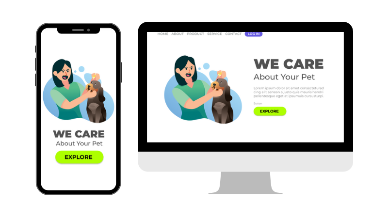

# We Care

   
   
   
   
   

 

> Esse projeto é um site simples para treino.

### Ajustes e melhorias

O projeto ainda não está finalizado.

- [x] Preparar código HTML
- [x] Estilizar com CSS
- [ ] Aplicar responsividade

## 💻 Pré-requisitos

Antes de começar, verifique se você atendeu aos seguintes requisitos:

- Você instalou a versão mais recente de <HTML, CSS e JS>.
- Você tem uma máquina <Windows / Linux / Mac>.

## 📫 Contribuindo para we-care

Para contribuir com we-care, siga estas etapas:

1. Bifurque este repositório.
2. Crie um branch: git checkout -b <nome_branch>.
3. Faça suas alterações e confirme-as: git commit -m '<mensagem_commit>'
4. Envie para o branch original: git push origin we-care / <local>
5. Crie a solicitação de pull.

Como alternativa, consulte a documentação do GitHub em [como criar uma solicitação pull](https://help.github.com/en/github/collaborating-with-issues-and-pull-requests/creating-a-pull-request).
